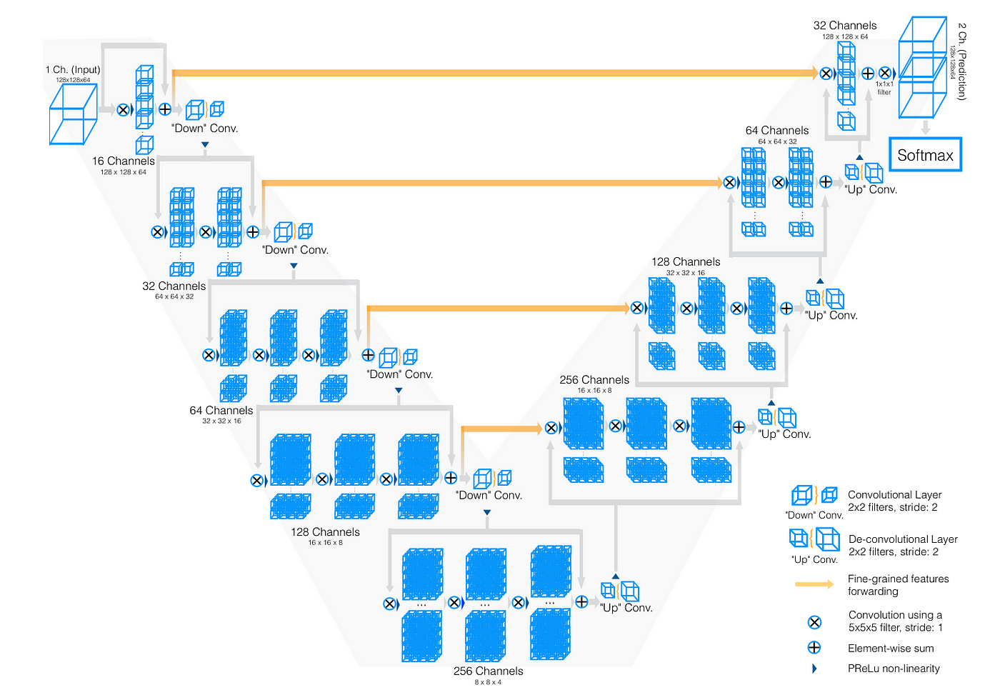
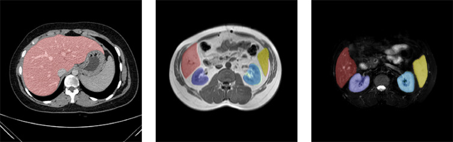

# 3D Image Segmentation using V-Net in TensorFlow

This repository provides a TensorFlow implementation of the V-Net model for 3D medical image segmentation. The V-Net architecture is designed for volumetric medical image segmentation, and this implementation is tailored for processing 3D NIfTI images. The code includes data preprocessing, model training, and inference pipelines.

## Model Architecture

- Contractive Path: A series of 3D convolutional layers followed by max-pooling to downsample the input volume.
- Expansive Path: A series of 3D transposed convolutional layers to upsample the feature maps.
- Skip Connections: Connections between corresponding layers in the contractive and expansive paths to preserve spatial information.

## V-Net Architecture



## Image Segmentation on CT Abdomen



## Default Configuration

- Input Shape: (512, 512, 128, 1) (Height, Width, Depth, Channels)
- Batch Size: 4
- Optimizer: Adam with a learning rate of 0.001
- Loss Function: Binary Cross-Entropy
- Metrics: Dice Coefficient
- Activation: ReLU
- Normalization: Batch Normalization

## Features

- 3D Convolutions: Efficient processing of volumetric data.
- Skip Connections: Improved gradient flow and feature preservation.
- Mixed Precision Training: Faster training with reduced memory usage on NVIDIA GPUs.
- Data Augmentation: Random flipping and cropping for improved generalization.

## Setup

### Requirements
- Python 3.8 or higher
- TensorFlow 2.x
- Nibabel (for NIfTI file handling)
- SimpleITK (for image resampling)
- Matplotlib (for visualization)
- NVIDIA GPU (optional, for accelerated training)

### Installation
1. Clone the repository:
```bash
    git clone https://github.com/imsidharthj/3d-image-segmentation.git
    cd 3d-image-segmentation
```

2. Install the required dependencies:
```bash
    pip install -r requirements.txt
```
3. Dataset URL
https://zenodo.org/records/7860267

## Directory Structure
```
    3D_image_segmentation/
    |── 3D_model           # Contains the model implementation and scripts for training, testing, and preprocessing
    │── data/
    │   ├── raw/
    │   │   ├── images/    # Original unprocessed images
    │   │   ├── labels/    # Corresponding ground truth segmentation masks
    │   ├── processed/
    │   │   ├── images/    # Resampled and normalized images
    │   │   ├── labels/    # Resampled and normalized labels
    │   ├── test/
    │   │   ├── images/    # Resampled and normalized images to test on trained model
    │   │   ├── labels/    # Resampled and normalized labels to test on trained model
    │── scripts/
    │   ├── 3D_model.py              # Main script for V-Net training, testing, and resampling
    │       ├── resample_nifti()     # Function to resample NIfTI images to a specified size
    │       ├── data_load()          # Function to load and preprocess the dataset
    │       ├── build_vnet()         # Function defining the V-Net architecture
    │       ├── train_vnet()         # Function to train the V-Net model
    │       ├── test_vnet()          # Function to perform inference using a trained model
    │── README.md                    # Project documentation
```

## Quick Start Guide

### Data Preparation

1. Divide dataset into two groups 80% for training and 20% for testing
- data/processed # contain 80% data for taining
- data/test # contain 20% data for testing

2. Place your raw NIfTI images and labels in the following directories:
- Raw Images: /path/to/data/raw/images
- Raw Labels: /path/to/data/raw/labels

3. Resample the images and labels to the desired size using the resample_nifti function:
```bash
    resample_nifti(input_dir='/path/to/data/raw/images', output_dir='/path/to/data/processed/images')
    resample_nifti(input_dir='/path/to/data/raw/labels', output_dir='/path/to/data/processed/labels')
```

### Training the Model

1. Load the dataset and create a TensorFlow Dataset object:
```bash
    dataset = data_load(image_dir='/path/to/data/processed/images',
                    label_dir='/path/to/data/processed/labels',
                    batch_size=4)
```

2. Train the V-Net model:
```bash
    train_vnet(dataset, num_epochs=10, learning_rate=0.001)
```

## Advanced

### Parameters
- Input Shape: (512, 512, 128, 1)
- Batch Size: 4
- Learning Rate: 0.001
- Number of Epochs: 10
- Dropout Rate: 0.2
- Activation: ReLU
- Optimizer: Adam

### Training Process
The model is trained using the Adam optimizer with a learning rate of 0.001. The loss function used is Binary Cross-Entropy, while the Dice Coefficient is utilized as an evaluation metric. By default, training runs for 10 epochs.

## Performance

### Training Performance

- Batch Size: 4
- Epochs: 10
- Dice Coefficient: ~0.85

### Inference Performance
- Training Time: ~3 hours on an NVIDIA V100 GPU
- Inference Time: ~5 seconds per scan (512x512x128)
